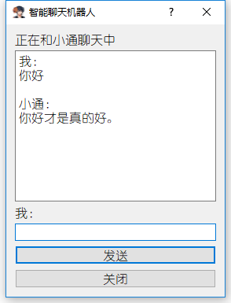

## 感谢原创者：https://github.com/Boreaso/tensorflow-chatbot
***
**本人另外新增PyQt5模块，进行了界面的展示：**

_附上PyQt5模块的安装教程：https://blog.csdn.net/zyngoo/article/details/85880572_

------

**对于模型的训练结果（已经进行迭代次数100 000）可以在此下载：**

> _链接：[百度云](https://pan.baidu.com/s/1uSViptDW3VQRn5pdbnCfiw )     提取码：y83s_
